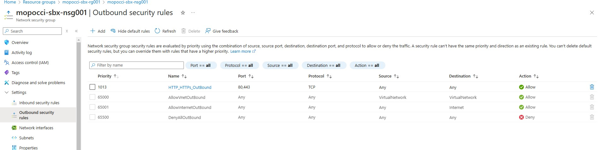

# Known issues

## CoreDNS nslookup error

If the following error occurs in custom training jobs with apps that use components to communicate with external systems for uploading blobs, such as the [mnist keras training app](./python/keras-mnist-training/), refer to the details below:

```sh
;; Got recursion not available from 10.0.0.10
;; Got recursion not available from 10.0.0.10
;; Got recursion not available from 10.0.0.10
;; Got recursion not available from 10.0.0.10
Server:         10.0.0.10
Address:        10.0.0.10#53

** server can't find mopoctbsbxsac001.blob.core.windows.net: NXDOMAIN
```

the CoreDNS ConfigMap needs to be edited to enable recursion trough `kubectl edit cm coredns -n kube-system` and adding following entry

```sh
header {
  response set ra
}
```

You might also want to review the CoreDNS ConfigMap in the deployed AKS view within the Azure Portal Web UI. 


You can also refer to this link for further guidance: https://jbn1233.medium.com/kubernetes-kube-dns-fix-nslookup-error-got-recursion-not-available-from-ff9ee86d1823. 

You can optionally review the outbound ports in the network security group associated with your VNet and consider adding a rule to allow outbound traffic on port 443.



