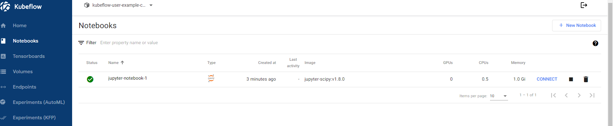

# ml-ops-ftw


## Table of Contents

+ [Summary](#summary)
+ [References](#references)
+ [Features](#features)
+ [Getting started](#getting-started)

## Summary

Repository showcasing ML Ops practices with kubeflow and mlflow

## References

- [MLOps Workflow: Recognizing Digits with Kubeflow](https://github.com/flopach/digits-recognizer-kubeflow/tree/master)
- [Deploy kubeflow into an AKS cluster using default settings](https://azure.github.io/kubeflow-aks/main/docs/deployment-options/vanilla-installation/) 
- [kubeflow - Minimum system requirements](https://deploy-preview-1319--competent-brattain-de2d6d.netlify.app/docs/started/k8s/overview/#minimum-system-requirements)

## Features

- [x] Deployment of Azure Kubernetes Service (AKS) clusters
- [x] kubeflow operator or mlflow helm chart installations in deployed AKS clusters
- [x] CD workflow for on-demand AKS deployments and kubeflow operator or mlflow helm chart installations
- [x] CD wofklow for on demand deployments of an Azure Storage Account Container **(For storing terraform state files)**
- [x] Added `devcontainer.json` with necessary tooling for local development
- [ ] Dockerized Python (pytorch or tensorflow) application for ML training purposes or Jupyter notebooks
    - [ ] CNN architecture training considering pre-trained models for image classification AI applications
    - [ ] (**OPTIONAL**) Transformer architecture training considering pre-trained models for chatbot AI applications
- [ ] Helm charts with K8s manifests for ML jobs (with and without kubeflow)
- [ ] Demonstration of model training and model deployment trough automation workflows
- [ ] (**OPTIONAL**) mlflow experiments for the machine learning lifecycle

## Getting started

Github workflows will be utilized in [this](./.github/workflows/) Github repository. Once the workflows described in the **Preconditions** and **Deploy an AKS cluster and install the kubeflow or mlflow components** sections have been successfully executed, all resource groups listed should be visible in the Azure Portal UI:

### Preconditions

0. Deploy an Azure Storage Account Service including container for terraform backends trough the [terraform.yml workflow](https://github.com/MGTheTrain/ml-ops-ftw/actions/workflows/terraform.yml) considering the `INFRASTRUCTURE_OPERATIONS option storage-account-backend-deploy`

### Deploy an AKS cluster and install the kubeflow or mlflow components

0. Deploy an AKS trough the [terraform.yml workflow](https://github.com/MGTheTrain/ml-ops-ftw/actions/workflows/terraform.yml) considering the `INFRASTRUCTURE_OPERATIONS option k8s-service-deploy`. 
1. **Optional:** Install ml-ops tools to an existing kubernetes cluster trough [terraform.yml workflow](https://github.com/MGTheTrain/ml-ops-ftw/actions/workflows/terraform.yml) considering the `INFRASTRUCTURE_OPERATIONS option ml-ops-tools-install`

**NOTE:** Set all the required Github secrets for aboves workflows


#### Port forwarding

To access the kubeflow dashboard following the installation of kustomize and kubeflow components, execute the following command:

```sh
kubectl get pods -A
kubectl port-forward -n <namespace>  <pod-name> <local-port>:<server-port>
kubectl port-forward svc/istio-ingressgateway -n istio-system 8080:80
```

and visit in a browser of choice `localhost:8080`. 

[Finally, open `http://localhost:8080` and login with the default user’s credentials. The default email address is `user@example.com` and the default password is `12341234`.](https://azure.github.io/kubeflow-aks/main/docs/deployment-options/vanilla-installation/)


---

To access the MLflow dashboard following the installation of the MLflow Helm chart, execute the following command:

```sh
kubectl port-forward -n ml-ops-ftw <mlflow pod name> 5000:5000
```

and visit in a browser of choice localhost:5000. 


### Jupyter notebooks

Once a Jupyter notebook instance has been successfully created:



`CONNECT` and select a launcher:


TBD - https://github.com/flopach/digits-recognizer-kubeflow/tree/master 

### Destroy the AKS cluster or uninstall ml tools

0. **Optional:** Uninstall only ml tools of an existing kubernetes cluster trough [terraform.yml workflow](https://github.com/MGTheTrain/ml-ops-ftw/actions/workflows/terraform.yml) considering the `INFRASTRUCTURE_OPERATIONS option ml-ops-tools-uninstall`
1. Destroy an AKS trough the [terraform.yml workflow](https://github.com/MGTheTrain/ml-ops-ftw/actions/workflows/terraform.yml) considering the `INFRASTRUCTURE_OPERATIONS option k8s-service-destroy`