# ml-ops-poc

## Table of Contents

+ [Summary](#summary)
+ [References](#references)
+ [Features](#features)
+ [Getting started](#getting-started)

## Summary

Repository showcasing ML Ops practices with kubeflow and mlflow

## References

- [MLOps Workflow: Recognizing Digits with Kubeflow](https://github.com/flopach/digits-recognizer-kubeflow/tree/master)
- [Deploy kubeflow into an AKS cluster using default settings](https://azure.github.io/kubeflow-aks/main/docs/deployment-options/vanilla-installation/) 
- [kubeflow - Minimum system requirements](https://deploy-preview-1319--competent-brattain-de2d6d.netlify.app/docs/started/k8s/overview/#minimum-system-requirements)

## Features

- [x] Deployment of Azure Kubernetes Service (AKS) clusters
- [x] kubeflow operator or mlflow helm chart installations in deployed AKS clusters
- [x] CD workflow for on-demand AKS deployments and kubeflow operator or mlflow helm chart installations
- [x] CD wofklow for on demand deployments of an Azure Storage Account Container **(For storing terraform state files)**
- [x] CD workflow for on-demand Azure Container Registry deployments in order to store internal Docker images.
- [x] Added `devcontainer.json` with necessary tooling for local development
- [x] Python (PyTorch or TensorFlow) application for ML training and inference purposes and Jupyter notebooks
    - [x] Simple feedforward neural network with MNIST dataset to map input images to their corresponding digit classes 
    - [x] CNN architecture training and inference considering COCO dataset for image classification AI applications (**NOTE:** Compute and storage intensive. Read `Download the COCO dataset images` comments on preferred hardware specs)
    - [ ] Transformer architecture training considering pre-trained models for chatbot AI applications
- [x] Dockerizing Python (PyTorch or TensorFlow) applications for ML training and inference
- [x] CI pipeline deploying an ACR
- [x] CI pipeline containerizing and pushing Python TensorFlow or PyTorch applications for training to a deployed ACR
- [ ] Helm charts with K8s manifests pulling containerized Python TensorFlow or PyTorch applications for ML jobs considering the [Training Operator for CRDs](https://github.com/kubeflow/training-operator)
- [x] Installation of the [Training Operator for CRDs](https://github.com/kubeflow/training-operator) and applying sample [TFJob and PyTorchJob](https://www.kubeflow.org/docs/components/training/overview/) k8s manifest

**NOTE:** [Steps 4 to 7 in the digits-recognizer-kubeflow GH repository](https://github.com/flopach/digits-recognizer-kubeflow) are not showcased here. These sections focus on saving the ML model in MinIO once the model is successfully built and trained. Furthermore, the trained model is served through KServe's inference HTTP service. The relevant files are:

- [The digits_recognizer_notebook.ipynb for model development and training, which also covers uploading the trained model to MiniO](https://github.com/flopach/digits-recognizer-kubeflow/blob/master/digits_recognizer_notebook.ipynb)
- [create_kserve_inference.yaml for spinning up the KServe inference HTTP service](https://github.com/flopach/digits-recognizer-kubeflow/blob/master/kubeflow_configs/create_kserve_inference.yaml)
- [kserve_python_test.ipynb for testing the Inference KServe HTTP service](https://github.com/flopach/digits-recognizer-kubeflow/blob/master/kserve_python_test.ipynb)
- [digits_recognizer_pipeline.ipynb to setup the ML pipeline](https://github.com/flopach/digits-recognizer-kubeflow/blob/master/digits_recognizer_pipeline.ipynb)

## Getting started

[Github workflows](./.github/workflows/) will be utilized in this Github repository. Once the workflows described in the **Preconditions** and **Deploy an AKS cluster and install the kubeflow or mlflow components** sections have been successfully executed, all resource groups listed should be visible in the Azure Portal UI:

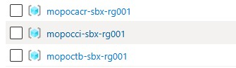
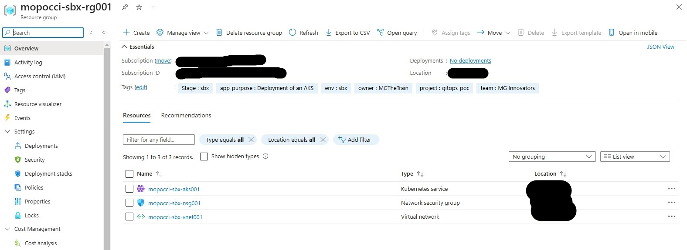

### Preconditions

0. Deploy an Azure Storage Account Service including container for terraform backends trough the [deploy-tf-backend workflow](https://github.com/MGTheTrain/ml-ops-poc/actions/workflows/deploy-tf-backend.yml)

### Deploy an AKS cluster, install the kubeflow or mlflow components or setup kubernetes resources for applications

0. Deploy an AKS trough the [manage-k8s-cluster workflow](https://github.com/MGTheTrain/ml-ops-poc/actions/workflows/manage-k8s-cluster.yml)
1. **Optional:** Install external helm charts (e.g. ml-ops tools) into the deployed kubernetes cluster trough [manage-helm-charts workflow](https://github.com/MGTheTrain/ml-ops-poc/actions/workflows/manage-helm-charts.yml)
2. **Optional:** Deploy kubernetes resources for application (secrets or reverse-proxy ingress) trough [manage-internal-k8s-resources workflow](https://github.com/MGTheTrain/ml-ops-poc/actions/workflows/manage-internal-k8s-resources.yml)

**NOTE:** 
- Set all the required Github secrets for aboves workflows
- In order to locally access the deployed AKS cluster launch the [devcontainer](./.devcontainer/devcontainer.json) and retrieve the necessary kube config as displayed in the GitHub workflow step labeled with title [Download the ~/.kube/config](https://github.com/MGTheTrain/ml-ops-poc/blob/3f5603fb986f0939be58b8f01b9e0121bde54e3b/.github/workflows/terraform.yml#L82)


### kubeflow

To access the kubeflow dashboard following the installation of kustomize and kubeflow components, execute the following command:

```sh
kubectl get pods -A
kubectl port-forward -n <namespace>  <pod-name> <local-port>:<server-port>
kubectl port-forward svc/istio-ingressgateway -n istio-system 8080:80
```

and visit in a browser of choice `localhost:8080`. 

[Finally, open `http://localhost:8080` and login with the default user’s credentials. The default email address is `user@example.com` and the default password is `12341234`.](https://azure.github.io/kubeflow-aks/main/docs/deployment-options/vanilla-installation/)

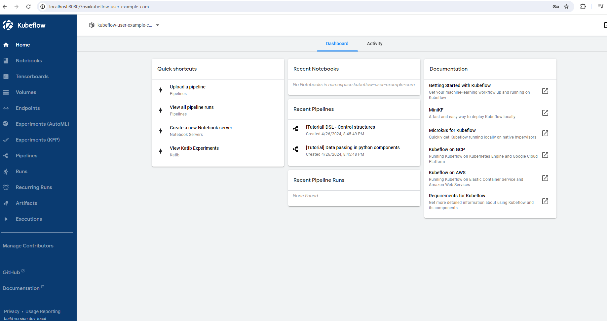

#### Jupyter notebooks

When creating the Jupyter notebook instance consider the following data volume:

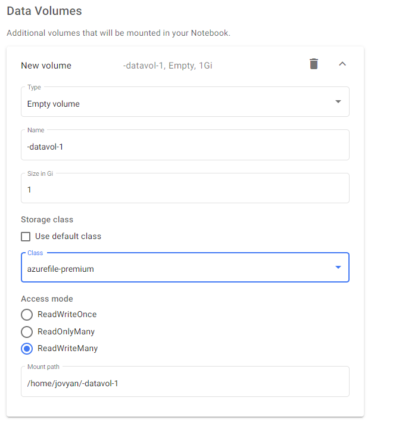

The volumes that were created appear as follows:

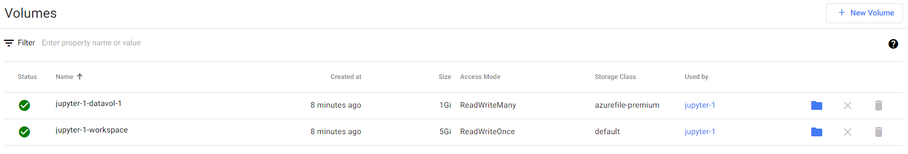

The Jypter instace that was created appear as follows:

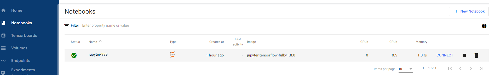

**NOTE:** You can check the status of the Jupyter instance pods:

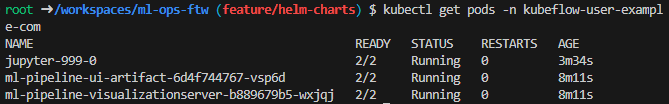

Once `CONNECTED` to a Jupyter instance ensure to clone this Git repository (HTTPS URL: `https://github.com/MGTheTrain/ml-ops-poc.git`):

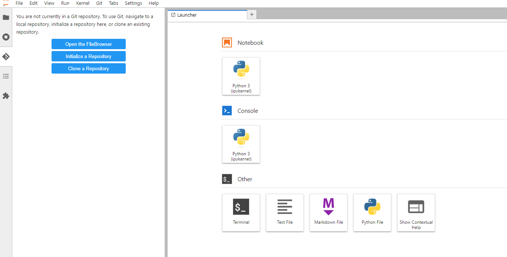

You then should have the repository cloned in your workspace:

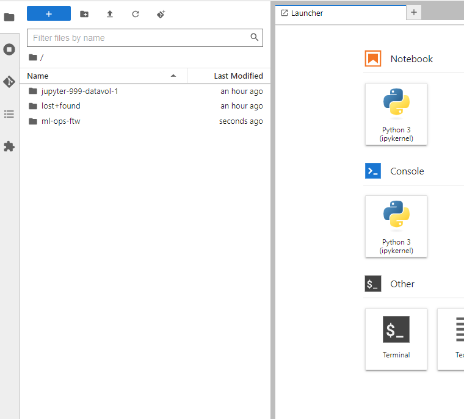

Execute a [Jupyter notebook](./notebooks/) to either train the model or perform inference (P.S. It's preferable to begin with the [mnist-trainnig.ipynb](./notebooks/mnist-trainnig.ipynb). Others are either resource intensive or not yet implemented):

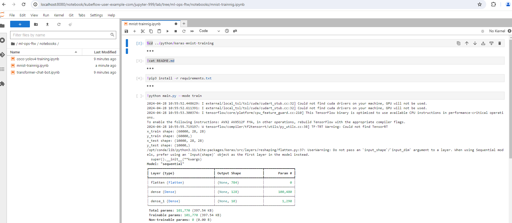

#### Applying TFJob or PyTorchJob k8s manifests 

After successful installation of the Kubeflow Training Operator, apply some sample k8s ML training jobs, e.g. [for PyTorch](https://www.kubeflow.org/docs/components/training/user-guides/pytorch/) and [for Tensorflow](https://www.kubeflow.org/docs/components/training/user-guides/tensorflow/).

```sh
# Pytorch (https://github.com/kubeflow/training-operator/blob/master/examples/pytorch/simple.yaml)
kubectl create -f https://raw.githubusercontent.com/kubeflow/training-operator/master/examples/pytorch/simple.yaml
```

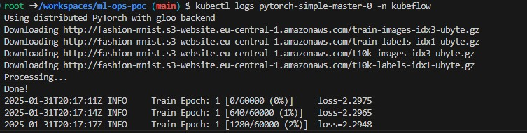
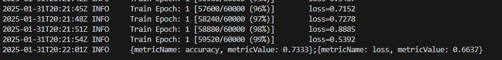

```sh
# Tensorflow (https://github.com/kubeflow/training-operator/blob/master/examples/tensorflow/simple.yaml)
kubectl create -f https://raw.githubusercontent.com/kubeflow/training-operator/master/examples/tensorflow/simple.yaml
```

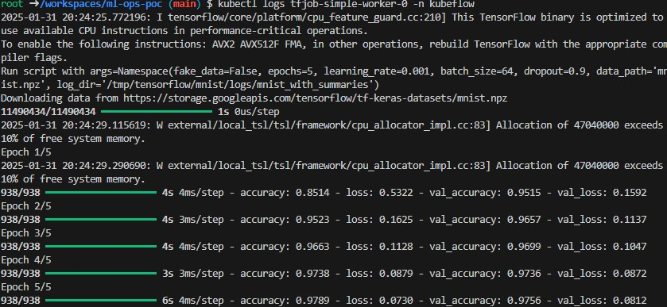

### mlflow

To access the MLflow dashboard following the installation of the MLflow Helm chart, execute the following command:

```sh
kubectl port-forward -n ml-ops-poc <mlflow pod name> 5000:5000
```

and visit in a browser of choice localhost:5000. 

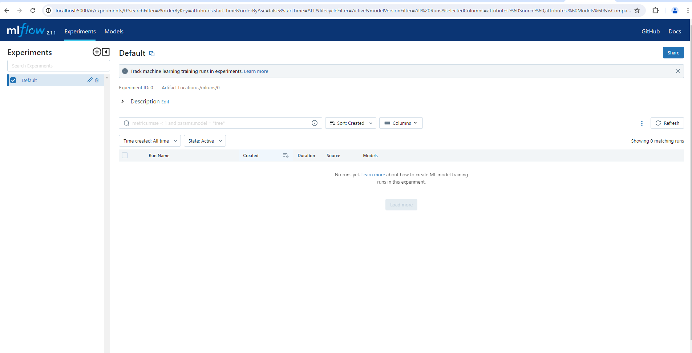

### Destroy the AKS cluster, uninstall helm charts or remove kubernetes resources for applications

0. **Optional:** Uninstall only ml tools of an existing kubernetes cluster trough [manage-helm-charts workflow](https://github.com/MGTheTrain/ml-ops-poc/actions/workflows/manage-helm-charts.yml)
1. **Optional:** Destroy kubernetes resources for application (secrets or reverse-proxy ingress) trough [manage-internal-k8s-resources workflow](https://github.com/MGTheTrain/ml-ops-poc/actions/workflows/manage-internal-k8s-resources.yml)
2. Destroy an AKS trough the [manage-k8s-cluster workflow](https://github.com/MGTheTrain/ml-ops-poc/actions/workflows/manage-k8s-cluster.yml)
