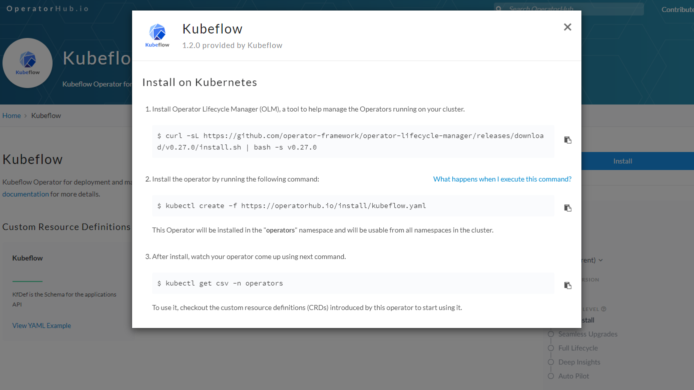

# ml-ops-ftw

## Table of Contents

+ [Summary](#summary)
+ [References](#references)
+ [Features](#features)
+ [Getting started](#getting-started)

## Summary

Repository showcasing ML Ops practices with kubeflow and mlflow

## References

- [MLOps Workflow: Recognizing Digits with Kubeflow](https://github.com/flopach/digits-recognizer-kubeflow/tree/master)
- [Installing Kubeflow Operator](https://v1-5-branch.kubeflow.org/docs/distributions/operator/install-operator/) 
  
- [kubeflow - Minimum system requirements](https://deploy-preview-1319--competent-brattain-de2d6d.netlify.app/docs/started/k8s/overview/#minimum-system-requirements)

## Features

- [x] Deployment of Azure Kubernetes Service (AKS) clusters
- [x] kubeflow operator or mlflow helm chart installations in deployed AKS clusters
- [x] CD workflow for on-demand AKS deployments and kubeflow operator or mlflow helm chart installations
- [x] CD wofklow for on demand deployments of an Azure Storage Account Container **(For storing terraform state files)**
- [x] Added `devcontainer.json` with necessary tooling for local development
- [ ] Dockerized Python (pytorch or tensorflow) application for ML training purposes or Jupyter notebooks
    - [ ] CNN architecture training considering pre-trained models for image classification AI applications
    - [ ] (**OPTIONAL**) Transformer architecture training considering pre-trained models for chatbot AI applications
- [ ] Helm charts with K8s manifests for ML jobs (with and without kubeflow)
- [ ] Demonstration of model training and model deployment trough automation workfflows
- [ ] (**OPTIONAL**) mlflow experiments for the machine learning lifecycle

## Getting started

TBD