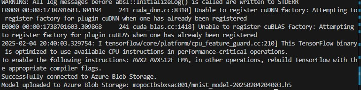

# ml-ops-poc

## Table of Contents

+ [Summary](#summary)
+ [References](#references)
+ [Features](#features)
+ [Getting started](#getting-started)

## Summary

Repository showcasing ML Ops practices with kubeflow and mlflow

## References

- [Deploy kubeflow into an AKS cluster using default settings](https://azure.github.io/kubeflow-aks/main/docs/deployment-options/vanilla-installation/) 
- [kubeflow - Minimum system requirements](https://deploy-preview-1319--competent-brattain-de2d6d.netlify.app/docs/started/k8s/overview/#minimum-system-requirements)
- [Deploy InferenceService with saved model on Azure](https://kserve.github.io/website/0.7/modelserving/storage/azure/azure/)
- [Kubeflow components and external add-ons. Note that KServe is an external add-on and needs to be installed](https://www.kubeflow.org/docs/)
- [Install KServe](https://kserve.github.io/website/0.7/admin/kubernetes_deployment/#3-install-kserve). **NOTE:** [KServe v0.7.0 leads to errors. v0.9.0 works](./KNWON_ISSUES.md)
- [Distributed Machine Learning Patterns Github repository](https://github.com/terrytangyuan/distributed-ml-patterns)

## Features

- [x] Deployment of Azure Kubernetes Service (AKS) clusters
- [x] kubeflow operator or mlflow helm chart installations in deployed AKS clusters
- [x] CD workflow for on-demand AKS deployments and kubeflow operator or mlflow helm chart installations
- [x] CD wofklow for on demand deployments of an Azure Storage Account Container **(For storing terraform state files)**
- [x] CD workflow for on-demand Azure Container Registry deployments in order to store internal Docker images.
- [x] Added `devcontainer.json` with necessary tooling for local development
- [x] Python (PyTorch or TensorFlow) application for ML training and inference purposes and Jupyter notebooks
    - [x] Simple feedforward neural network with MNIST dataset to map input images to their corresponding digit classes 
    - [x] CNN architecture training and inference considering COCO dataset for image classification AI applications (**NOTE:** Compute and storage intensive. Read `Download the COCO dataset images` comments on preferred hardware specs)
    - [ ] Transformer architecture training considering pre-trained models for chatbot AI applications
- [x] Dockerizing Python (PyTorch or TensorFlow) applications for ML training and inference
- [x] CI pipeline deploying an ACR
- [x] CI pipeline containerizing and pushing Python TensorFlow or PyTorch applications for training to a deployed ACR
- [x] Helm charts with K8s manifests for containerized Python TensorFlow/PyTorch ML jobs using the [Training Operator for CRDs](https://github.com/kubeflow/training-operator) and GitOps via ArgoCD
- [x] Installation of the [Training Operator for CRDs](https://github.com/kubeflow/training-operator) and applying sample [TFJob and PyTorchJob](https://www.kubeflow.org/docs/components/training/overview/) k8s manifest
- [x] Enable GPU accelerated ML trainning and inference k8s pods. Add corresponding helm charts

## Getting started

[Github workflows](./.github/workflows/) will be utilized in this Github repository. Once the workflows described in the **Preconditions** and **Deploy an AKS cluster and install the kubeflow or mlflow components** sections have been successfully executed, all resource groups listed should be visible in the Azure Portal UI:


### Preconditions

0. Deploy an Azure Storage Account Service including container for terraform backends trough the [deploy-tf-backend workflow](https://github.com/MGTheTrain/ml-ops-poc/actions/workflows/deploy-tf-backend.yml)

### Deploy an AKS cluster, install the kubeflow or mlflow components or setup kubernetes resources for applications

0. Deploy an AKS trough the [deploy-k8s-cluster workflow](https://github.com/MGTheTrain/ml-ops-poc/actions/workflows/deploy-k8s-cluster.yml)
1. **Optional:** Install external helm charts (e.g. ml-ops tools) into the deployed kubernetes cluster trough [install-helm-charts workflow](https://github.com/MGTheTrain/ml-ops-poc/actions/workflows/install-helm-charts.yml)
2. **Optional:** Deploy kubernetes resources for application (secrets or reverse-proxy ingress) trough [create-internal-k8s-resources workflow](https://github.com/MGTheTrain/ml-ops-poc/actions/workflows/create-internal-k8s-resources.yml)

**NOTE:** 
- Set all the required Github secrets for aboves workflows
- In order to locally access the deployed AKS cluster launch the [devcontainer](./.devcontainer/devcontainer.json) and retrieve the necessary kube config as displayed in the GitHub workflow step labeled with title [Download the ~/.kube/config](https://github.com/MGTheTrain/ml-ops-poc/blob/3f5603fb986f0939be58b8f01b9e0121bde54e3b/.github/workflows/terraform.yml#L82)


### kubeflow

To access the kubeflow dashboard following the installation of kustomize and kubeflow components, execute the following command:

```sh
kubectl port-forward svc/istio-ingressgateway -n istio-system 8080:80
```

and visit in a browser of choice `localhost:8080`. 

[Finally, open `http://localhost:8080` and login with the default user’s credentials. The default email address is `user@example.com` and the default password is `12341234`.](https://azure.github.io/kubeflow-aks/main/docs/deployment-options/vanilla-installation/)


#### Jupyter notebooks

When creating the Jupyter notebook instance consider the following data volume:


The volumes that were created appear as follows:


The Jypter instace that was created appear as follows:


**NOTE:** You can check the status of the Jupyter instance pods:


Once `CONNECTED` to a Jupyter instance ensure to clone this Git repository (HTTPS URL: `https://github.com/MGTheTrain/ml-ops-poc.git`):


You then should have the repository cloned in your workspace:


Execute a [Jupyter notebook](./notebooks/) to either train the model or perform inference (P.S. It's preferable to begin with the [mnist-trainnig.ipynb](./notebooks/mnist-trainnig.ipynb). Others are either resource intensive or not yet implemented):


#### Applying TFJob or PyTorchJob k8s manifests 

After successful installation of the Kubeflow Training Operator, apply some sample k8s ML training jobs, e.g. [for PyTorch](https://www.kubeflow.org/docs/components/training/user-guides/pytorch/) and [for Tensorflow](https://www.kubeflow.org/docs/components/training/user-guides/tensorflow/).

```sh
# Pytorch (https://github.com/kubeflow/training-operator/blob/master/examples/pytorch/simple.yaml)
kubectl create -f https://raw.githubusercontent.com/kubeflow/training-operator/master/examples/pytorch/simple.yaml
```


```sh
# Tensorflow (https://github.com/kubeflow/training-operator/blob/master/examples/tensorflow/simple.yaml)
kubectl create -f https://raw.githubusercontent.com/kubeflow/training-operator/master/examples/tensorflow/simple.yaml
```


You can also register and sync ArgoCD applications referencing Helm charts to enable GitOps. For more details check out the [gitops-poc repository](https://github.com/MGTheTrain/gitops-poc).
Essential commands for the [Keras MNIST training example](./python/keras-mnist-training/) are:

```sh
# Port forward in terminal process A
kubectl port-forward -n external-services svc/argocd-server 8080:443

# The default username is admin. The default password can be obtained trough: kubectl -n argocd get secret argocd-initial-admin-secret -n external-services -o jsonpath="{.data.password}" | base64 -d

# In terminal process B - Login
argocd login localhost:8080
# Prompted to provide username and password

# e.g. for keras-mnist-training chart
argocd app create keras-mnist-training \
  --repo https://github.com/MGTheTrain/ml-ops-poc.git \
  --path gitops/argocd/keras-mnist-training \ 
  --dest-server https://kubernetes.default.svc \
  --dest-namespace internal-apps \
  --revision main \
  --server localhost:8080

# In terminal process B - Sync Application
argocd app sync keras-mnist-training
# In terminal process B - Monitor Application Status
argocd app get keras-mnist-training
```

The ArgoCD applications that have been registered and synchronized should resemble the following:


Training job logs resemble:



The training job considers the upload of the trained model to an Azure Storage Account Container as the final step:


Training job status resemble:


#### KServe InferenceService

Refer to the [following link for guidance](https://kserve.github.io/website/0.7/modelserving/storage/azure/azure/#deploy-the-model-on-azure-with-inferenceservice).

Set up an authorized Azure Service Principal: 

```sh
az ad sp create-for-rbac --name model-store-sp --role "Storage Blob Data Owner" --scopes /subscriptions/<your subscription id>/resourceGroups/<your resource group name>/providers/Microsoft.Storage/storageAccounts/<your storage account name>
```

Edit the secrets `stringData` values file:

```sh
kubectl apply -n internal-apps -f - <<EOF
apiVersion: v1
kind: Secret
metadata:
  name: azcreds
type: Opaque
stringData:
  AZ_CLIENT_ID: <your AZ_CLIENT_ID>
  AZ_CLIENT_SECRET: <your AZ_CLIENT_SECRET>
  AZ_SUBSCRIPTION_ID: <your AZ_SUBSCRIPTION_ID>
  AZ_TENANT_ID: <your AZ_TENANT_ID>
EOF
```

Register and synchronize the ArgoCD application:

```sh
# Port forward in terminal process A
kubectl port-forward -n external-services svc/argocd-server 8080:443

# In terminal process B - Login
argocd login localhost:8080
# Prompted to provide username and password

# e.g. for keras-mnist-inference chart
argocd app create keras-mnist-inference \
  --repo https://github.com/MGTheTrain/ml-ops-poc.git \
  --path gitops/argocd/keras-mnist-inference \ 
  --dest-server https://kubernetes.default.svc \
  --dest-namespace internal-apps \
  --revision main \
  --server localhost:8080

# In terminal process B - Sync Application
argocd app sync keras-mnist-inference
```

Due to AKS node resource constraints experiments related to InferenceServices trough KServe have been aborted:


### mlflow

To access the MLflow dashboard following the installation of the MLflow Helm chart, execute the following command:

```sh
kubectl port-forward -n ml-ops-poc <mlflow pod name> 5000:5000
```

and visit in a browser of choice localhost:5000. 


### Destroy the AKS cluster, uninstall helm charts or remove kubernetes resources for applications

0. **Optional:** Uninstall only ml tools of an existing kubernetes cluster trough [uninstall-helm-charts workflow](https://github.com/MGTheTrain/ml-ops-poc/actions/workflows/uninstall-helm-charts.yml)
1. **Optional:** Destroy kubernetes resources for application (secrets or reverse-proxy ingress) trough [delete-internal-k8s-resources workflow](https://github.com/MGTheTrain/ml-ops-poc/actions/workflows/delete-internal-k8s-resources.yml)
2. Destroy an AKS trough the [destroy-k8s-cluster workflow](https://github.com/MGTheTrain/ml-ops-poc/actions/workflows/destroy-k8s-cluster.yml)